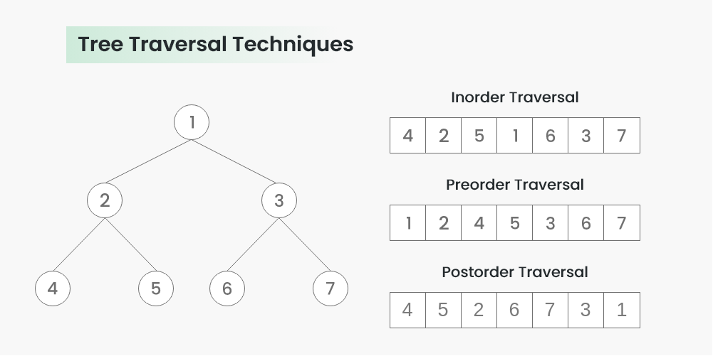

# Data Structure Interview Questions:

## Tree Structure:

### Types of Node tree:

- General trees
- Binary trees
- Binary Search trees
- M-way trees
- AVL trees

### Node tree in context of data structure:

Trong ngữ cảnh của cấu trúc dữ liệu, "node tree" (cây nút) là một cấu trúc phân cấp gồm các nút. Mỗi nút chứa dữ liệu và
một tham chiếu tới các nút con của nó, nếu có. Các nút trong cây được kết nối với nhau bằng các cạnh, biểu thị các mối
quan hệ giữa chúng.

Trong cây nút, thường có một nút đặc biệt được gọi là nút gốc (root node), đó là điểm bắt đầu hoặc nút cao nhất của cây.
Từ nút gốc, các nút khác được kết nối theo cấu trúc nhánh. Các nút không có nút con được gọi là nút lá hoặc nút cuối.

Cách sắp xếp và tổ chức các nút trong cây có thể khác nhau tùy thuộc vào loại cấu trúc cây cụ thể đang được sử dụng. Ví
dụ về cấu trúc cây bao gồm cây nhị phân, cây AVL, cây B, và nhiều loại cây khác. Mỗi loại cấu trúc cây áp đặt các quy
tắc và thuộc tính cụ thể về sắp xếp và mối quan hệ giữa các nút.

Cây nút được sử dụng rộng rãi trong các cấu trúc dữ liệu và thuật toán khác nhau. Chúng cung cấp một cách hiệu quả để
biểu diễn các mối quan hệ phân cấp và được sử dụng trong các ứng dụng như cây tìm kiếm, cây quyết định, cây biểu thức,
hệ thống tệp, và nhiều ứng dụng khác.

### Binary Tree:

Definition:

#### Giải thích:

Cây nhị phân (Binary tree) là một cấu trúc dữ liệu cây trong đó mỗi nút (node) có thể chứa tối đa hai con, được gọi là
con trái và con phải. Một đặc điểm quan trọng của cây nhị phân là mỗi con trái chỉ có thể chứa một nút con trái và mỗi
con phải chỉ có thể chứa một nút con phải. Các nút không có con được gọi là nút lá (leaf node).

#### Ứng dụng:

Cây nhị phân thường được sử dụng trong nhiều ứng dụng khác nhau, bao gồm cấu trúc dữ liệu và thuật toán như cây tìm kiếm
nhị phân (binary search tree), cây bao trùm nhị phân (binary heap), cây AVL và cây đỏ-đen (red-black tree).

Cấu trúc cây nhị phân cho phép thực hiện nhiều thao tác hiệu quả, bao gồm tìm kiếm, chèn và xóa các nút. Việc sắp xếp
các nút trong cây nhị phân có thể được thực hiện theo các quy tắc cụ thể, chẳng hạn như cây tìm kiếm nhị phân mà các nút
trái nhỏ hơn nút cha và các nút phải lớn hơn nút cha.

#### Chiều cao của node tree:

Chiều cao của một nút trong cây (node) được định nghĩa là số lượng cạnh trên đường đi từ nút đó đến nút lá xa nhất.
Chiều cao của cây (tree) là chiều cao của nút gốc (root node).

Để tính chiều cao của một nút trong cây, ta có thể sử dụng:

- phương pháp đệ quy
- phương pháp duyệt cây

### Sự khác nhau giữa node cha và node con:
| Node cha                       | Node Con|
|--------------------------------|---------|
|Đây là nút trực tiếp liên kết với một nút con. Nút cha là nút gần nhất đứng trên cùng một nhánh của cây và có thể có một hoặc nhiều nút con.  Nút cha điều khiển và điều hướng các nút con của nó trong cây.  Một nút cha không có nút cha được gọi là nút gốc (root node) của cây.|  Đây là các nút trực tiếp được liên kết với một nút cha. Một nút con là một nút mà nút cha trực tiếp điều khiển và có thể có hoặc không có nút con của riêng nó. Một nút không có nút con được gọi là nút lá (leaf node) hoặc nút cuối.|

### What are the different types of node tree traversal algorithms? 
Có ba thuật toán duyệt cây (traversal algorithms) phổ biến trong cấu trúc cây nút, bao gồm:
- Duyệt theo thứ tự trước (Preorder traversal): Trong thuật toán này, ta thực hiện các bước theo thứ tự sau: trước khi duyệt nút con trái, sau đó duyệt nút con phải, và cuối cùng là duyệt nút hiện tại. Do đó, thứ tự của các nút được duyệt là gốc - trái - phải.
- Duyệt theo thứ tự giữa (Inorder traversal): Trong thuật toán này, ta thực hiện các bước theo thứ tự sau: trước khi duyệt nút con trái, sau đó duyệt nút hiện tại, và cuối cùng là duyệt nút con phải. Điều này dẫn đến thứ tự duyệt là trái - gốc - phải. Trong cây nhị phân, duyệt theo thứ tự giữa sẽ cho kết quả tăng dần (nếu cây đã được sắp xếp).
- Duyệt theo thứ tự sau (Postorder traversal): Trong thuật toán này, ta thực hiện các bước theo thứ tự sau: trước khi duyệt nút con trái, sau đó duyệt nút con phải, và cuối cùng là duyệt nút hiện tại. Do đó, thứ tự duyệt là trái - phải - gốc. Trong cây nhị phân, duyệt theo thứ tự sau thường được sử dụng để giải phóng các nút trong bộ nhớ.

#### How do you search for a specific node in a node tree?
To search for a specific node in a node tree, you can follow these steps:
                          
- Start at the root node: Begin the search from the root node of the tree.

- Compare the target value: Compare the target value you are searching for with the value of the current node.

- If the values match: If the values match, then the current node is the node you are searching for. You can stop the search and return the current node or perform any desired operation.

- If the target value is smaller: If the target value is smaller than the value of the current node, move to the left child of the current node (if it exists). Repeat steps 2 to 4 recursively on the left subtree.

- If the target value is larger: If the target value is larger than the value of the current node, move to the right child of the current node (if it exists). Repeat steps 2 to 4 recursively on the right subtree.

- Continue until found or not found: Repeat steps 2 to 5 until either the target node is found (values match) or the search reaches a node with no further children (indicating the target node is not present in the tree).

- Return result: If the target node is found, you can return it or perform any desired operation. If the search concludes without finding the target node, you can return a suitable indication (e.g., null, false, or an appropriate message) to indicate that the node was not found.

